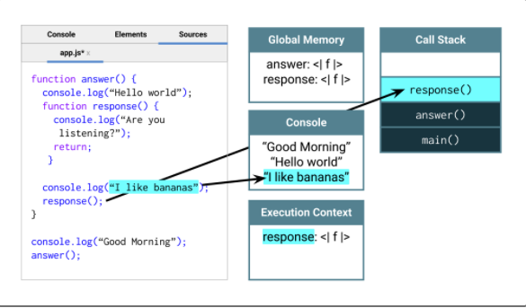

# regex
Module 17 Challenge: Computer Science for JavaScript

## Purpose
Identify the building blocks of JavaScript

Inspect JavaScript's runtime process

Analyze asynchronous behavior as a background task

## Built With
* Benchmark.js
* Git Hub

## Contribution
Made with ❤️ by Samantha Malone
Shout out to my tutor
© 2021 Samantha Malone. All rights reserved.
